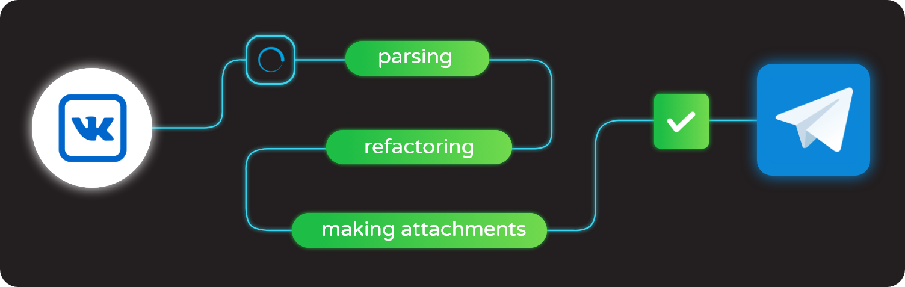

# Авто-репост из Vkontakte в Telegram


### Как это работает?
Бот парсит последние (поумолчанию 10) посты у группы из ВКонтакте. Если пост содержит "ключевой тег", который
задаётся пользователем в настройках, то будут скачаны вложения поста, а текст будет распарсен, отрефакторен и после
этого отправлен в телеграмм канал со всеми вложениями. Также ID отправленных постов будут сохранены в файле, поэтому при перезапуске бота
он не будет заново отправлять уже обработанные посты. Цель бота - отказоустойчивость, поэтому при ошибках анализа постов
(которые могут чаще всего произойти во вложениях), бот просто пропустит эти данные и запишет Warning в лог-файл **assets/warnings.log**
* **Как запустить бота?** Укажите свои настройки в файле **config.py**, а затем в терминале выполните команду
```
python3 main.py
```
* **Как очистить хранилище обработанных постов?** Вы можете удалить файл **assets/ids.bin**. Либо же выполнить данный пайтон код:
```python
from assets.storage import Store

Store('ids').clear()
```
* **Как мне делать репост всех постов, а не только по ключевому-тегу?** Просто оставьте поле **key_tag** в файле настроек **config.py** равным пустой строке
## Зависимости
```
pip install -r requirements.txt
```
Также понадобится библиотека FFMPEG для сжатия видео. На Linux:
```
sudo apt install ffmpeg
```
> Мой pull request на pyTelegramBotAPI уже мерджанули, но релизная версия не вышла. Поэтому telebot надо устанавливать
> напрямую из их github репозитория
> package directly from github repository
>```
>pip install git+https://github.com/eternnoir/pyTelegramBotAPI#egg=telebot
>```
## Остальное
### TODO
* Pull Request бибилиотеки pyTelegramBotAPI, где добавить в метод send_animations параметры width и height
(и внести эти изменения в метод обработки GIF)
* Улучшить связность метода **text_contains_link_of_attached_video** в классе Post
* Метод **create_telegram_attachments** у класса Sender попробовать реализовать сразу в методе **parse_attachments** у класса Post
* Добавить авто-тесты для класса Sender 
### Тесты
Запускаются из главной директории проекта командой **pytest**
